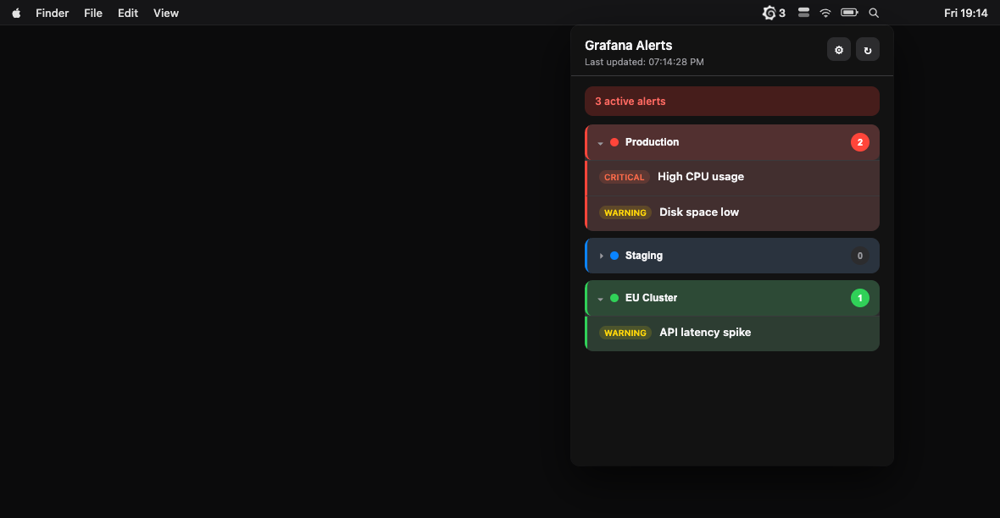
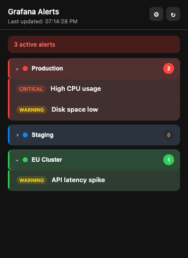
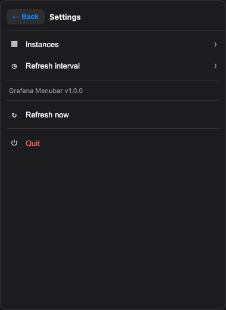
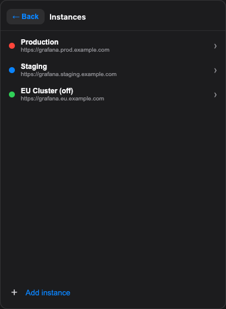
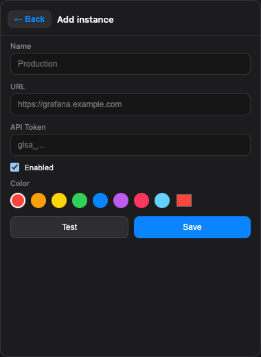

# Grafana Scope

Monitor active Grafana alerts from the macOS menu bar.

> **Repo:** [github.com/manassevitz/Grafana_Scope](https://github.com/manassevitz/Grafana_Scope)

<p align="center">
  
</p>

## Screenshots

Real captures from the app (sample data for the demo).

| Alerts | Settings |
|:---:|:---:|
|  |  |

| Instances | Add instance |
|:---:|:---:|
|  |  |

## Requirements

- macOS
- Node.js 18 or later

## Installation

### Option 1: Install globally

```bash
npm install -g .
```

Then run:

```bash
grafana-menubar
```

### Option 2: Run locally

```bash
npm install
npm start
```

`npm start` keeps the terminal open. To run it in the background and free the console:

```bash
nohup ./node_modules/.bin/electron . > /dev/null 2>&1 &
```

Or after a global install:

```bash
nohup grafana-menubar > /dev/null 2>&1 &
```

To stop the app, use **Settings → Quit**, or from the project directory:

```bash
pkill -f "electron.*$(pwd)"
```

## Configuration

1. **Left-click** the menu bar icon to view alerts.
2. Click **⚙** in the header to open Settings.
3. Add your Grafana instances with:
   - **Name** — display label (e.g. Production)
   - **URL** — Grafana base URL (e.g. `https://grafana.example.com`)
   - **API Token** — service token with alert read permissions
   - **Color** — optional color to identify the instance

### Create an API token in Grafana

1. Go to **Administration → Service accounts** (or **API Keys** on older versions).
2. Create a token with **Viewer** role or alert read permissions.
3. Copy the token (format `glsa_...`).

## Features

- Menu bar icon with alert count next to it
- Alerts grouped by instance (expand/collapse)
- Custom color per instance
- Alert name and severity badge
- Manual refresh (↻) and auto-refresh (configurable interval)
- Settings: manage instances, refresh interval, refresh now, quit

## API used

Fetches active alerts from Grafana Alertmanager (read-only):

```
GET /api/alertmanager/grafana/api/v2/alerts?active=true&silenced=false&inhibited=false
```

The `silenced=false` filter is in the API query only — the app does not silence alerts or open Grafana in the browser.

## Commands

| Command | Description |
|---------|-------------|
| `npm install` | Install dependencies |
| `npm start` | Run the app locally (foreground, keeps terminal open) |
| `nohup ./node_modules/.bin/electron . > /dev/null 2>&1 &` | Run locally in background |
| `nohup grafana-menubar > /dev/null 2>&1 &` | Run global install in background |
| `npm install -g .` | Install globally |
| `grafana-menubar` | Run the app (after global install) |

## Notes

- The app does not appear in the Dock (menu bar only).
- Configuration is stored in `~/Library/Application Support/grafana-menubar/`.
- Compatible with Grafana Unified Alerting (Grafana 8+).

## License

MIT
