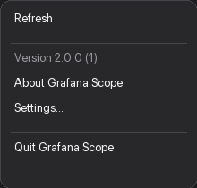
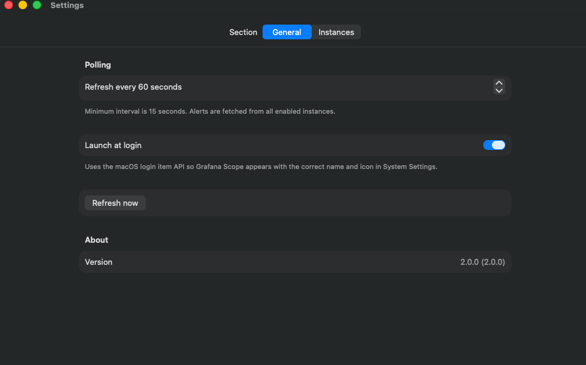
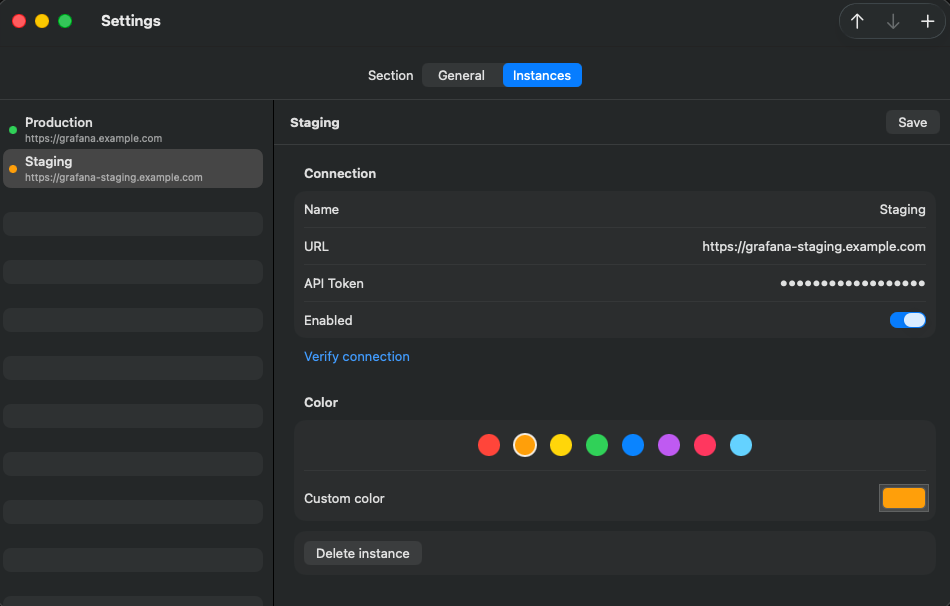
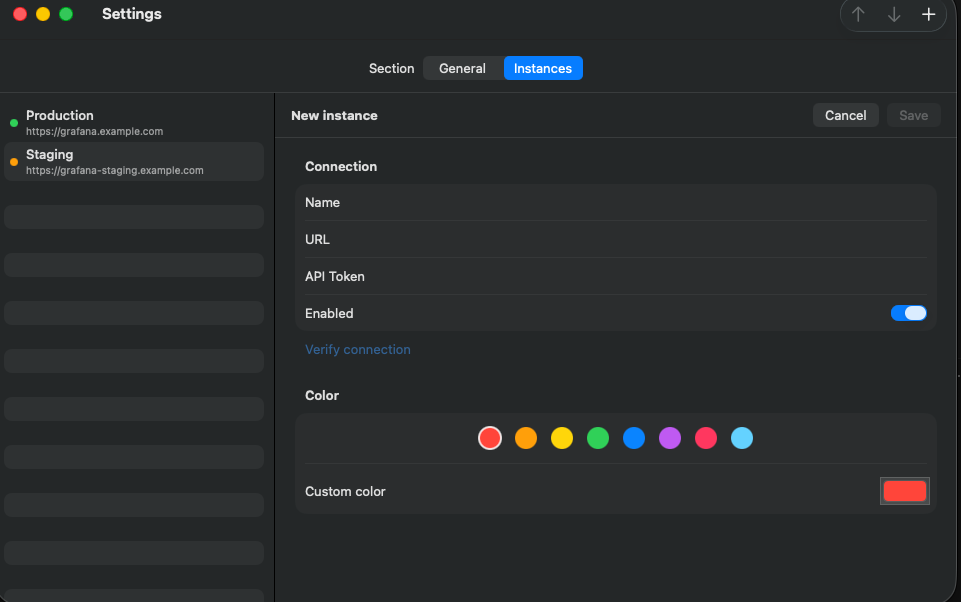

# Grafana Scope

Native **macOS menu bar app** (Swift) that monitors active Grafana Unified Alerting alerts across multiple instances.


## Features

- Menu bar icon with active alert count
- Alerts grouped by Grafana instance (expand/collapse)
- Preset palette **or custom color** per instance
- Alert name + severity badge
- Manual refresh and configurable auto-refresh (15–3600 s)
- Separate **Settings** and **About** windows
- **Launch at login** via macOS login item API (`SMAppService`)
- Read-only (does not silence alerts or open Grafana)
- No Dock icon — lives in the menu bar only
- Template icon adapts to light/dark menu bar

## Requirements

- macOS 13 (Ventura) or later
- Xcode Command Line Tools: `xcode-select --install`

## Quick start

```bash
git clone <repo-url>
cd grafana-scope

# Build
./GrafanaScope/scripts/build.sh

# Run once (foreground)
open "build/Grafana Scope.app"
```

1. Click the **lightning bolt** icon in the menu bar.
2. Open **Settings** from the gear menu (or right-click the menu bar icon).
3. Add your Grafana instances under **Instances**.

## Install for daily use

Installs to `~/Applications/Grafana Scope.app`, registers a login item, and starts the app.

```bash
./GrafanaScope/scripts/install-service.sh
```

Uninstall (removes app, login item, and local config):

```bash
./GrafanaScope/scripts/uninstall-service.sh
```

| Path | Purpose |
|------|---------|
| `~/Applications/Grafana Scope.app` | Application bundle |
| `~/Library/Application Support/Grafana_Scope/config.json` | Instance config |
| `~/Library/Logs/grafana-scope.log` | Service log (legacy LaunchAgent only) |

After install, enable **Launch at login** in **Settings → General** if it is not already on. The entry in **System Settings → Login Items** should show **Grafana Scope** with the app icon (not a generic `exec` icon).

## UI overview

### Alerts panel


Alerts are grouped by instance. Click a group header to expand or collapse. Severity badges: critical, warning, low.

### Settings menu



Right-click the menu bar icon or use the gear menu for Refresh, About, Settings, and Quit.

### Settings → General



| Option | Description |
|--------|-------------|
| **Refresh interval** | Auto-refresh every 15–3600 seconds (saved automatically) |
| **Launch at login** | Register/unregister macOS login item |
| **Refresh now** | Manual poll |
| **Version** | App version and build |

### Settings → Instances



Each instance has a name, URL, API token, enabled flag, and color. Use the preset dots or the **Custom color** picker.

Reorder instances with **↑ ↓** or drag rows in the sidebar. Click **Save** (`⌘S`) after editing.

### Add instance



Use **Verify connection** to check `/api/health` before saving.

| Field | Example |
|-------|---------|
| Name | `Production` |
| URL | `https://grafana.example.com` |
| API Token | Grafana service account token with alert read access |

## Configuration file

```
~/Library/Application Support/Grafana_Scope/config.json
```

Example shape: [`config.example.json`](config.example.json) (generic URLs/tokens only — safe for the repo).

**Local config is never committed** (`~/Library/Application Support/Grafana_Scope/config.json` is gitignored).

To load demo instances locally (for screenshots), then restore yours:

```bash
./GrafanaScope/scripts/load-demo-config.sh    # backs up config.json → config.json.backup
# … capture screenshots …
./GrafanaScope/scripts/restore-config-backup.sh
```

## Grafana API

| Endpoint | Purpose |
|----------|---------|
| `GET /api/alertmanager/grafana/api/v2/alerts?active=true&silenced=false&inhibited=false` | Active alerts |
| `GET /api/health` | Connection test |

Auth: `Authorization: Bearer {token}`

## Verify before release

```bash
# 1. Build
./GrafanaScope/scripts/build.sh

# 2. Run locally
open "build/Grafana Scope.app"

# 3. Reinstall service (optional)
./GrafanaScope/scripts/install-service.sh

# 4. Refresh README screenshots (real captures required)
#    See docs/screenshots/README.md
./GrafanaScope/scripts/load-demo-config.sh   # optional demo data
python3 GrafanaScope/scripts/prepare-readme-screenshots.py
```

Checklist:

- [ ] Menu bar icon visible; count updates after refresh
- [ ] Settings opens in its own window (not overlay)
- [ ] Instance selection loads the correct editor
- [ ] Instance reorder reflected in alerts panel
- [ ] Custom color picker saves and appears in alerts groups
- [ ] Launch at login shows **Grafana Scope** with app icon in System Settings
- [ ] README screenshots contain no internal URLs or tokens

## Project layout

```
GrafanaScope/
  GrafanaScope/              Swift source (SwiftUI + MenuBarExtra)
    Resources/               LogoSource.png, generated AppIcon / MenuBarIcon
  scripts/
    build.sh                 Build .app bundle + AppIcon.icns
    install-service.sh       Install to ~/Applications + login item
    uninstall-service.sh     Remove app and config
    load-demo-config.sh      Load config.example.json locally (backs up yours first)
    restore-config-backup.sh Restore config from before demo load
    generate-icons.py        Regenerate icons from LogoSource.png
    prepare-readme-screenshots.py
config.example.json          Example config shape
docs/screenshots/            README screenshots (processed)
scripts/                     Shortcuts → GrafanaScope/scripts/
build/                       Generated app (gitignored)
```

## Development

Built with SwiftUI and `MenuBarExtra` (`.window` style). No Xcode project required — compiles with `swiftc` via `build.sh`.

To change the version shown in Settings, edit `CFBundleShortVersionString` and `CFBundleVersion` in `GrafanaScope/GrafanaScope/Info.plist`.
